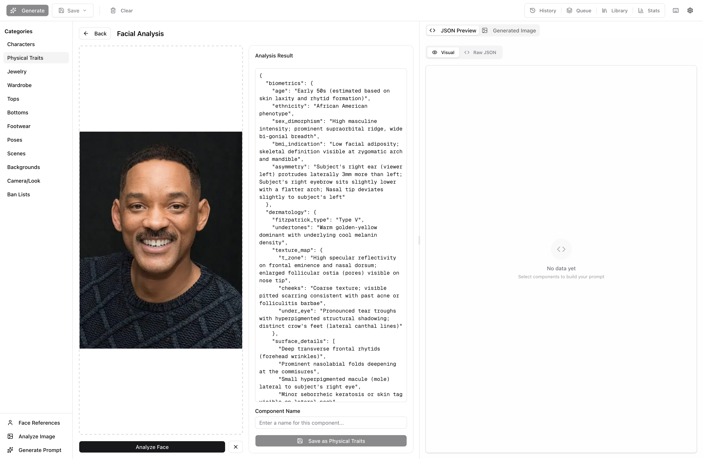
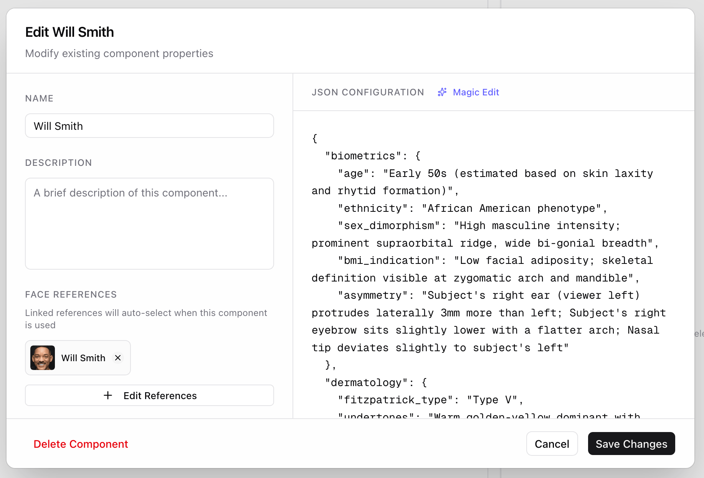
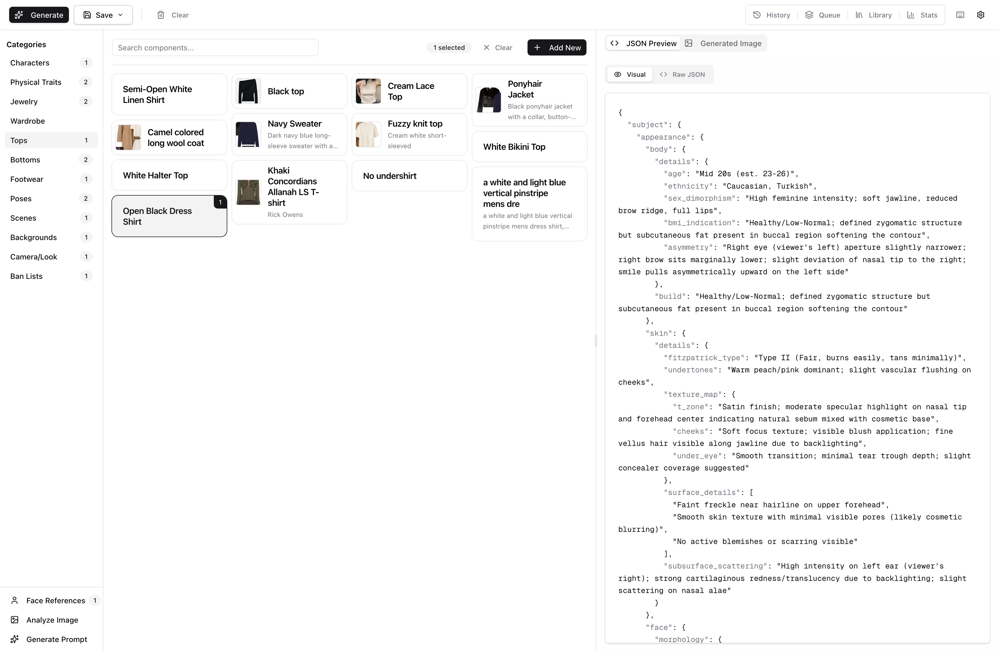
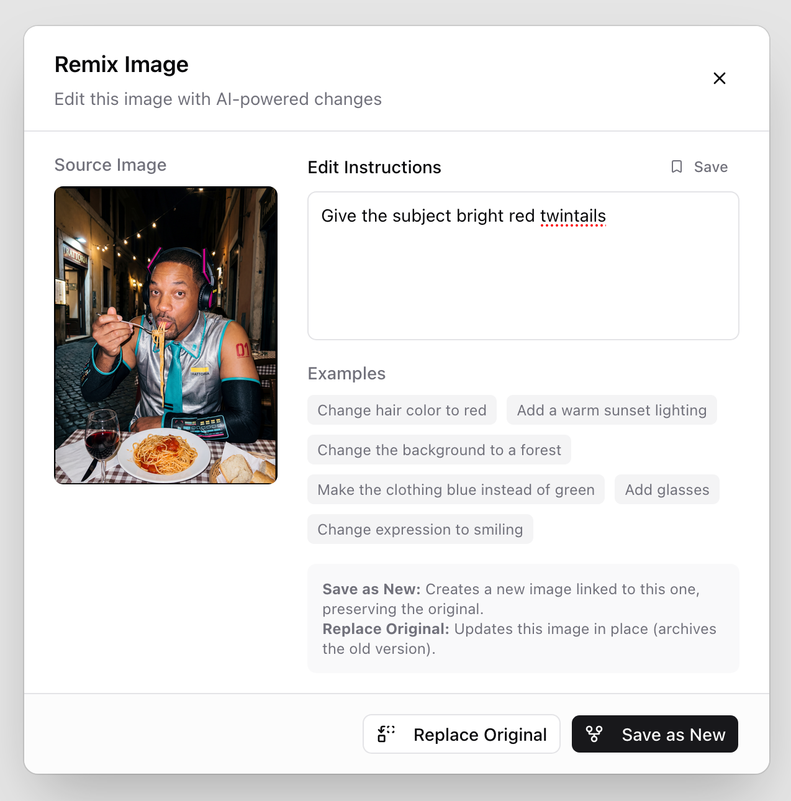

# Structured Imagegen

A tool for generating images with Nano Banana based on structured components.

```diff
- NOTE: This project is a part of a personal exploration on experimental Claude Code usage.
- This entire project is YOLO'd, with the code having never been looked at.
- I have taken care to ensure that this code is safe to run, however
- be warned that it has not been checked by human eyes.
```

---

All these images are generated with ImageGen.

<p align="center">
  
  
</p>

You can even generate the same background with consistency.

<p align="center">
  
  
  
</p>

---

### Analyze a face to build a character

Upload a reference photo and the tool extracts detailed information about the subject and returns a structured JSON component you can reuse across generations.

<p align="center">
  
</p>

### Configure components with structured JSON

Each component (character, wardrobe, pose, scene) is a JSON block you can edit directly. Link face references so they're auto-selected when composing prompts.

<p align="center">
  
</p>

### Compose prompts from hot-swappable parts

The builder lets you pick from your saved components across categories—swap a wardrobe, change the scene, add accessories and change the posing—and preview the assembled JSON prompt before generating.

<p align="center">
  
</p>

### Browse, filter, and compare generations

Every generation is tagged with the components that built it. Filter by character, wardrobe, scene, or any tag to find what you're looking for.

<p align="center">
  
</p>

### Remix with natural language edits

Edit generated images with natural language easily in-app.

<p align="center">
  
  
</p>

<p align="center">
  
</p>

---

## Documentation

- [**Installation**](docs/installation.md) - Setup guide, env vars, and database init.
- [**Features**](docs/features.md) - Overview of builder, analysis, and history tools.
- [**Usage**](docs/usage.md) - Workflow guide from component creation to generation.

## Quick Start

```bash
# Install dependencies
bun install

# Setup database
bun db:migrate && bun db:seed

# Start server
bun dev
```
